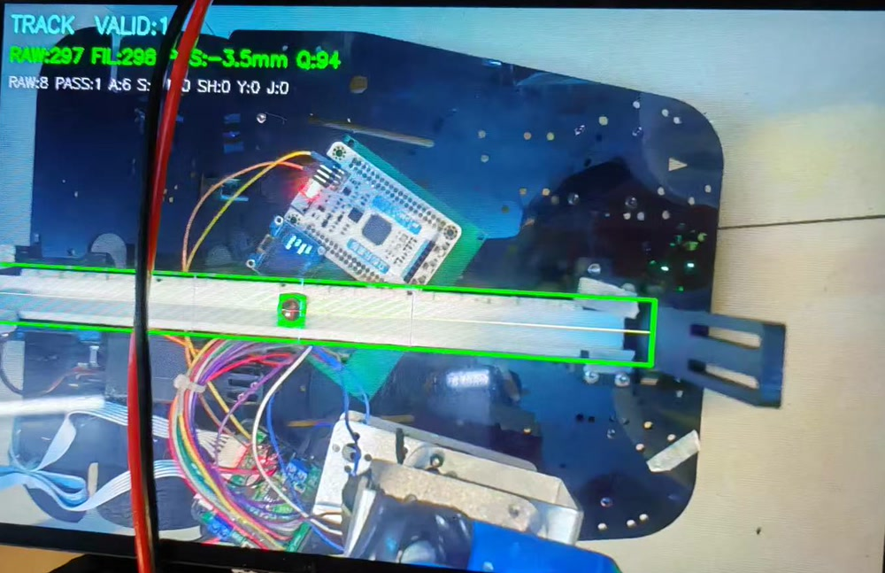
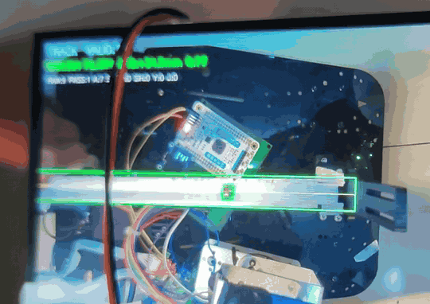
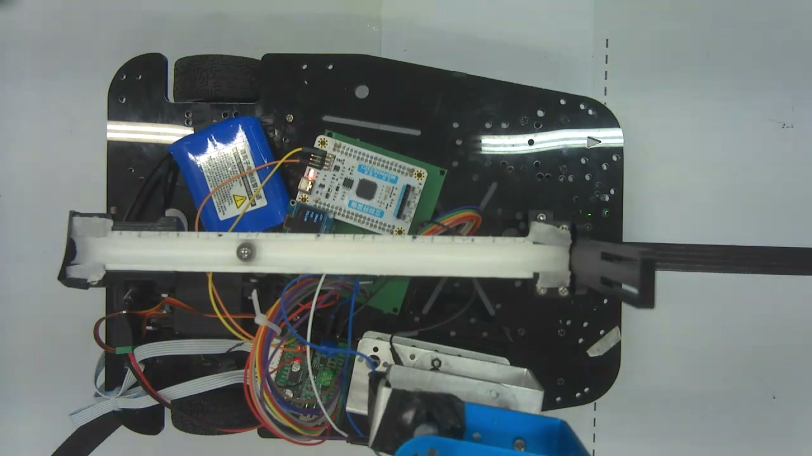
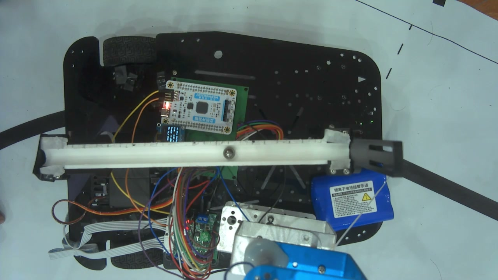

# 车载平衡滚球视觉系统 —— K230 单 Sensor 双通道（识别 + 图传）

**个人技术练习项目。** 任务背景是「车载平衡滚球」——一颗 ⌀1cm 的钢球在摆动的水管凹槽里来回滚动。
练习目标：在立创·庐山派 K230 上，用**一个摄像头**同时完成两件互相冲突的事——给主控喂实时球位、给上位机推实时画面。

**技术路线：传统视觉（灰度阈值 + 形态学 + 轮廓几何筛选 + 跟踪预测），不用深度学习。**
当时的路线取舍考虑见文末「关于技术路线的说明」。

---

## 演示



K230 本地 ST7701 屏的翻拍画面：**绿色大框是 ROI（裁出来的搜索区域），小绿框是当前锁定的钢球**，左上角是逐帧读数——`TRACK` 跟踪状态、`VALID:1` 本帧有效、`SEQ` 帧号、位置（mm）、`Q` 质量分。



动图截取自一段现场录像（5 秒，为控制体积做过抽帧与缩放）：钢球沿水管凹槽来回滚动，绿框持续跟随，`SEQ` 递增、`VALID` 保持 1。

> 素材是**手机翻拍屏幕**，因此有反光、有手持晃动，也没有原始 30 fps 的流畅度。同一段 5 秒区间、未经抽帧与缩放的短片（30 fps / 770×544，无音频）见 [`media/demo_local_screen.mp4`](media/demo_local_screen.mp4)。
>
> 注意：这**不是**图传画面。图传走的是 CH0 干净通道，上面不绘制任何识别标记——原因见第一节末尾。

---

## 〇、开发方式说明（请先读这一节）

本仓库代码在 **AI 编程助手辅助下完成**。本人负责的部分是：需求拆解、方案取舍、实机联调、参数整定、串口协议对接、现场调试与联调排障；**具体的代码实现有相当一部分由 AI 生成**。本人对整体架构、数据流和各个参数的含义是掌握的，但对 CanMV/MicroPython 底层驱动的部分 API 细节仍需查阅文档。

因此本文档的定位是：**如实描述"这份代码实际做了什么"**。它不代表作者能对这些设计给出严格实验数据支撑的工程结论。凡未经实测的指标，本文档一律标注为「设计目标」或「待实测」，不做数字上的宣称。

如果你是在评估这份代码的技术水平——建议直接看 `src/` 的实现和文末「已知限制」，而不是本文档的措辞。

---

## 一、系统全景

```text
              GC2093 摄像头（1080p30 统一输入）
                          │
        ┌─────────────────┴─────────────────┐
        │            Sensor（仅 reset 一次）  │
        └─────────────────┬─────────────────┘
                          │
        ┌─────────────────┴──────────────────┐
        │                                     │
      CH0                                   CH1
  1280×720@30                          640×480 RGB888
  YUV420SP                              中心裁剪
        │                                     │
  硬件 H.264 编码                        裁 ROI(550×55)
  2 Mbps / GOP 30                       → 灰度 → 暗色掩膜
        │                               → 形态学 → 轮廓筛选
   RTSP :8554/ball                      → 跟踪状态机
        │                               → 中值 + 一阶低通
        ↓                                     │
   OBS 拉流录制                       三点标定 → 0.1mm 位置
   （后台线程）                                │
                                     UART2 @115200 / 25Hz
                                              ↓
                                       MSPM0G3507 主控
                                        （主线程）
```

**核心原则：控制链路是主线程，图传是后台线程。图传的任何异常都不允许影响控制。**

主程序：`src/k230_h3_ball_rtsp_integrated.py`（1669 行）

### 图传画面实拍（CH0 干净画面）



上面是 OBS 从 RTSP 拉流录制的原始画面（1280×720@30）。可以看到完整车体：白色水管凹槽、凹槽里的 ⌀1cm 钢球、立创·庐山派 K230、电池与 MSPM0 主控。



第二张能看清**水管上的刻度线**——这些刻度、接缝和管壁边缘都会在二值图中形成"看起来合格"的候选，正是下面 3.4 节「跟踪状态机」要处理的问题。

> **为什么图传画面里没有识别框？**
> 图传录制的是 **CH0 干净画面**，这是刻意的设计（见第六节「线程模型」）。识别框、ROI 边界、凹槽中心线只绘制在 **CH1 视觉帧**上、显示于本地 ST7701 屏，**因此不会出现在图传录像里**。
> 想看识别框长什么样，就看本文开头的「演示」一节——那是直接翻拍本地屏得到的画面。

---

## 二、输出规格（均为代码中可直接确认的参数）

下表全部是**输出规格**，不是实测精度。识别成功率、定位误差这类实测指标本项目**没有做过定量统计**。

| 参数 | 值 | 说明 |
|---|---|---|
| 识别对象 | ⌀1cm 银色钢球，位于白色水管凹槽内 | |
| 画面中球径 | 20～30 px（设计期望值 24 px） | 与摄像头安装高度有关，改高度需重调 |
| 位置输出单位 | 0.1 mm（分辨率，非精度） | 量程 ±125 mm，与 25cm 摆杆物理范围一致 |
| 串口输出频率 | 25 Hz（发送间隔 40 ms） | 受主控串口中断负载约束 |
| 视觉通道 | 640×480 RGB888 | |
| 图传 | 1280×720@30 / 2 Mbps / RTSP | |

> **注意区分两个"帧率"**：传感器采集、图传和本地屏显示都是 30 fps，但**下发给主控的位置数据是 25 Hz**（40 ms 一个包）。对外表述时要说清指的是哪一个。
>
> 30 fps 这个数**有实测依据**：联调期间用 OBS 从 RTSP 拉流录制了 5 段视频（共约 17 分钟），`ffprobe` 显示全部为 **H.264 / 1280×720 / 30 fps**。而 25 Hz 由代码里的发送间隔决定（`UART_SEND_INTERVAL_MS = 40`），属于设计值，未做长时间统计。
>
> 1 px 约等于 0.5 mm（由下方三点标定比例推出）。这是**换算分辨率**，实际定位误差还取决于阈值分割和轮廓中心估计，本项目未测量。

如果需要在面试或答辩中给出实测数字，可以用下面这个自测方法现测，比引用估计值可靠：

```text
1) 定位误差：用尺子在凹槽上标出 -50/-25/0/+25/+50 mm 五个点，
   把球逐点静置，读串口输出的 POS10（单位 0.1mm）与实际位置对比，
   记录最大偏差 → 就是定位误差。
2) 锁定成功率：球静置时连续统计 2 分钟串口帧，算 VALID=1 的帧数占比。
3) 实际输出频率：看 SEQ 字段每秒增长多少，即为真实 Hz。
```

---

## 三、识别算法（传统视觉）

> 本节描述的是**代码里的实现逻辑与参数含义**，不是逐项的实验结论。每个参数的取值来源在代码注释里都有记录；其中阈值类参数的整定方式是"现场看着画面调"，而非网格搜索或对比实验。

### 3.1 分层裁剪，避免整幅转换

CanMV 的 OpenCV 模板可通过 `to_numpy_ref()` 把 RGB888 帧**零拷贝**转成 ulab 数组。因此先截 ROI（550×55）再转灰度，而不是每帧转换整幅 640×480：

```python
roi_rgb  = image_np[ROI_Y:ROI_Y+ROI_H, ROI_X:ROI_X+ROI_W]   # 550 × 55
gray_roi = cv2.cvtColor(roi_rgb, cv2.COLOR_BGR2GRAY)
gray_roi = cv2.GaussianBlur(gray_roi, (5, 5), 0)
```

> 先裁 ROI 再转灰度，只减少计算量、不改变 ROI 内的灰度计算结果，**不会降低识别精度**。

### 3.2 为什么用「暗色掩膜」而不是找亮球

银色钢球有强中心高光，直接找亮圆会被灯光反射大量误检。而**球的外圈轮廓和下方阴影始终偏暗**，因此做反向阈值：

```python
_, mask = cv2.threshold(gray_roi, 125, 255, cv2.THRESH_BINARY_INV)
mask = cv2.morphologyEx(mask, cv2.MORPH_CLOSE, kernel, iterations=1)  # 连通高光造成的断裂
mask = cv2.morphologyEx(mask, cv2.MORPH_OPEN,  kernel, iterations=1)  # 去孤立噪点
```

3×3 小核是刻意的：核再大就会把钢球和凹槽刻度、管壁边缘粘成一个长条区域。

### 3.3 几何筛选 + 评分选优

对每个外轮廓按顺序过滤：

| 条件 | 阈值 |
|---|---|
| 面积 | 50 ～ 1000 px² |
| 外接框宽 | 10 ～ 40 px |
| 外接框高 | 8 ～ 40 px |
| 宽高比 | 0.45 ～ 2.00 |
| 圆心距凹槽中心线 | \|Δy\| ≤ 18 px（凹槽中心 Y=297） |

圆度与填充率**只参与评分、不做硬过滤**——钢球的高光、阴影和凹槽遮挡经常破坏完整圆形，卡死会把真球也筛掉。

通过的候选按代价函数取最小值：

```python
score = 4.0 * |Δy|                    # 纵向偏离凹槽中心线
      + 1.0 * |diameter - 24|         # 尺寸偏离期望球径
      + 0.40 * (1 - circularity) * 20 # 圆度惩罚
      + 0.30 * |fill_ratio - 0.65| * 10
      + 2.0 * |Δx - predicted_x|      # 仅在 TRACK 阶段生效
```

并据此给出 **quality = clamp(100 - 0.8 × score, 0, 100)**，随帧下发，让主控自行判断该帧测量值的可信度。

### 3.4 跟踪状态机

单帧几何匹配在现场不够用（刻度、接缝、车体反光都会形成合格候选），因此加了三态跟踪：

| 状态 | 行为 | 退出条件 |
|---|---|---|
| **SEARCH** | 完全不用历史位置，只按几何条件全局找球 | 连续 3 帧在相近位置（≤35 px）出现候选 → 锁定进入 TRACK |
| **TRACK** | 加入预测位置约束，单帧跳变 > 65 px 判为干扰并丢弃 | 连续丢 4 帧 → 回落 SEARCH |
| **LOST** | SEARCH 中；连续丢 10 帧则清空历史位置与速度 | 重新锁定 → TRACK |

清空历史很重要：否则画面会一直显示一个已经失效的 `LAST_X`，重新找球也不是从干净状态开始。

速度估计**只用于预测候选搜索位置，不下发给主控**——避免把速度噪声引入闭环。预测时间上限 0.15 s，防止搜索窗口被带偏。

### 3.5 滤波

```python
最近 3 帧原始坐标取中值  →  一阶低通 α = 0.55
                             速度低通 α = 0.35
```

α 的取值思路是：滚球闭环对**延迟**比对**平滑**更敏感，滤得太重会让控制系统相位滞后，所以取在偏灵敏一侧（代码注释给出的建议区间是 0.45～0.65）。中值先滤掉偶发跳点，低通再压高频抖动。

> **这个值是按现场观感定的**——画面跟手、静止时不抖，就采用了；没有做过阶跃响应或频域实验。如果被问到"0.55 是怎么定下来的"，直接这样回答比编一个实验过程稳妥。

---

## 四、像素到物理位置的标定

三点标定，把球依次放在 **-5 cm / O 点 / +5 cm**，读取画面左上角的 `RAW_X` 填入：

```python
PIXEL_AT_NEG_50MM = 220
PIXEL_AT_ZERO_MM  = 320   # 主要用于画中心标记、检查安装偏差
PIXEL_AT_POS_50MM = 420
```

换算只使用 ±5 cm 两点，比例由 100 mm 的真实距离确定：

```python
position_mm = -50.0 + (pixel_x - PIXEL_AT_NEG_50MM) * 100.0 / (PIXEL_AT_POS_50MM - PIXEL_AT_NEG_50MM)
position_0p1mm = clamp(round(position_mm * 10), -1250, 1250)
```

> 若画面中 +X 方向朝左，`PIXEL_AT_POS_50MM` 可以小于 `PIXEL_AT_NEG_50MM`，公式依然成立，**不需要另外加负号**。

改造成融合版后 Sensor 输入由 `1280×960@60` 统一为 `1920×1080@30`，CH1 再中心裁剪成 640×480——分辨率不变但**视野范围可能变化**，所以 ROI 和三个标定点必须按实机画面重新核对，不能直接沿用。

---

## 五、串口协议（K230 → MSPM0G3507）

NMEA 风格 ASCII 帧，带逐字节异或校验：

```text
$BALL,SEQ,POS10,PIXEL_X,VALID,QUALITY*CS\r\n
```

| 字段 | 含义 |
|---|---|
| `SEQ` | 0～9999 循环帧序号，主控可据此判断丢帧 |
| `POS10` | 相对 O 点位置，**单位 0.1 mm**，范围 ±1250 |
| `PIXEL_X` | 滤波后的原始横向像素，便于现场重新标定 |
| `VALID` | 1 = 本帧测量有效；0 = 丢球或尚未稳定锁定 |
| `QUALITY` | 0～100 识别质量，供主控判断可信度 |
| `CS` | 从字符 `B` 到 `*` 之前所有字节的逐字节异或，`%02X` |

```python
def xor_checksum(payload):
    checksum = 0
    for char in payload:
        checksum ^= ord(char)
    return checksum
```

**接线**（两块板必须共地；K230 单独可靠供电，不要由 MSPM0 的 3.3V 脚供电）：

```text
K230 GPIO5 / UART2_TX  →  MSPM0 PA22 / UART2_RX
K230 GPIO6 / UART2_RX  ←  MSPM0 PB15 / UART2_TX
K230 GND               —  MSPM0 GND
```

115200 / 8N1，发送间隔限制 40 ms，避免无意义占用主控串口中断。另有 `UartCommandReceiver` 处理主控下行指令。

---

## 六、鲁棒性设计

现场网络不可靠，但控制链路必须不受影响：

| 异常场景 | 实际行为 |
|---|---|
| 未配置热点 / 未开热点 | 视觉与 UART 照常启动运行，不阻塞、不退出 |
| Wi-Fi 密码错误 | 后台按 2～10 s 退避重试，控制链路不受影响 |
| 运行中热点断开 | 视觉与 UART 继续；重开热点后 RTSP 自动恢复 |
| OBS 中途关闭再打开 | K230 不重启，重连同一 RTSP 地址即可恢复 |
| 启动时序 | 连接成功后需**连续稳定 8 秒**才对外发布 RTSP 地址 |
| 取流卡死 | 连续 6 次 `GetStream` 失败触发受控复位（可配置，含 5 s 倒计时） |
| 状态可见性 | GPIO20 LED：慢闪 = Wi-Fi 连接/恢复中，常亮 = RTSP 已启动 |

**线程模型**：Wi-Fi、RTSP、编码流排空在后台线程；视觉识别与 UART 在主线程。

**资源释放顺序**（顺序颠倒会出现 `device busy` / `already initialized` / 摄像头无帧）：

```text
通知 Wi-Fi / RTSP / 编码排空线程退出
  → 等待后台 GetStream 返回并完成 ReleaseStream
  → 停止 Sensor
  → 解除 Sensor → VENC 绑定
  → 停止并销毁 VENC
  → 关闭显示与 UART
```

**脱机部署**：联调通过后重命名为 `/sdcard/main.py`，断电重启由 `__main__` 自启，不依赖电脑与 IDE。正式运行采用「上电只启动一次」，可显著降低重复初始化造成的阻塞概率。

---

## 七、现场调试可视化

开 `DRAW_ALL_CANDIDATES` 后，实体屏上按颜色分层显示筛选过程，用于现场快速定位调参方向：

| 颜色 | 含义 |
|---|---|
| 黄色细框 | 二值图中的原始轮廓 |
| 蓝色框 | 通过面积 / 尺寸 / 宽高比 / 纵向位置过滤 |
| 绿色框 | 最终选中的钢球 |

同时叠加 ROI 边界、凹槽中心线与三点标定线，以及各阶段拒绝计数（raw / area / size / ratio / shape / y / jump），能直接看出"漏检卡在哪一步"。

---

## 八、性能调优

确认识别稳定后，正式运行前可以关闭本地显示与调试绘制，把时间全部留给视觉：

```python
ENABLE_LOCAL_DISPLAY = False
DRAW_DEBUG_OVERLAY   = False
DISPLAY_TO_IDE       = False
```

另外把原本「每 10 帧强制 GC」改为**定时回收（30 s 一次）**，减小控制周期的抖动。

网络不稳时的调整优先级（**不要动视觉分辨率和 ROI**，两条通道用途独立）：

1. 缩短 K230 与热点距离，固定在 2.4 GHz 信道
2. `VIDEO_BIT_RATE_KBPS` 从 2000 降到 1500
3. `VIDEO_FPS` 与 `SENSOR_MODE_FPS` 同步降到 25
4. 最后才考虑降低图传分辨率

---

## 九、目录结构

```text
├─ src/
│  ├─ k230_h3_ball_rtsp_integrated.py   最终版：单 Sensor 双通道融合
│  ├─ h3_ball_tracker_uart.py           视觉跟踪 + UART 打包发送
│  └─ k230_rtsp_vision_ready.py         视觉优先版（不含图传，作降级备份）
├─ docs/
│  ├─ 融合版试运行说明.md                 首次联调顺序、脱机四项测试
│  ├─ 视觉识别版说明.md
│  └─ 脱机部署说明.md
├─ media/
│  ├─ demo_local_screen.jpg             本地屏实拍（含 ROI 与钢球选框）
│  ├─ demo_tracking.gif                 识别跟踪动图（截取自本地屏录像）
│  ├─ demo_local_screen.mp4             上述动图的完整短片（无音频）
│  ├─ system_overview.jpg               CH0 图传画面：整车俯视
│  └─ pipe_scale_and_led.jpg            CH0 图传画面：水管刻度与指示灯
└─ experiments/
   └─ yolov8-alternative/               备选方案：YOLOv8n 自训练（未被采用）
```

---

## 十、关于技术路线的说明

### 10.1 实际情况

项目**先后存在两条技术路线**：

- `experiments/yolov8-alternative/`：YOLOv8n 自训练方案。走通了「板载采图 → labelme 标注 → YOLOv8n 训练 → ONNX → nncase 量化 → `.kmodel`」的完整链路，但**没有完成板端部署验证**，训练产物也未保留。
- `src/`：传统视觉方案，**最终采用**，也是本仓库的主体。

也就是说：这是**一个"评估过两条路、最终用了一条"的项目**，而不是"两条路都跑通并做过定量对比"的项目。两者之间没有可比对的实测数据。

### 10.2 当时采用传统视觉的考虑

下面几条来自当时的判断和实机调试感受，**不是对照实验的结论**，所以每条都标了依据强度，方便读者自行取舍：

| 考虑点 | 当时的判断 | 依据强度 |
|---|---|---|
| 场景先验 | 目标只有一种、尺寸固定、位置被凹槽约束 → 几何条件本身就是很强的先验，阈值 + 轮廓筛选够用 | 强（场景事实） |
| 反光问题 | 钢球是金属的，训练/量化过程中出现过亮斑影响识别的情况，换光照就要补数据 | 中（定性观察，没有统计漏检率） |
| 现场可调性 | 阈值、面积、ROI、标定点都能在现场直接改，改完立刻见效；模型要重新采数据重训，周期长得多 | 强（工程现实） |
| 算力占用 | 只处理 550×55 的 ROI，像素量约为整幅 640×480 的三十分之一，CPU 上负担很轻 | 中（量级判断，未做精确计时） |
| 能不能闭环 | 传统视觉在实机上能稳定输出坐标、把控制环闭合起来 | 中（能跑通，但未测误差） |

### 10.3 需要说清楚的边界

- **没有做过"YOLO 漏检率 vs 传统视觉漏检率"的对比测试。** 被追问时如实说：YOLO 那条路走通了训练与格式转换，但没完成板端部署验证，所以不存在两者的对比数据。
- **传统视觉是有代价的**：它依赖"白色水管 + 暗钢球"这个对比度先验。换浅色球、深色轨道或强侧光，全部阈值都要重新整定。它不是泛化方案，只是在**这个特定场景**下够用。
- "深度学习的价值在于泛化，而本题不需要泛化"是一句**选型逻辑**，不是实验结果。

---

## 十一、已知限制

- 依赖白色水管 + 暗色钢球的**对比度先验**。换用浅色球、深色轨道或强侧光环境需要重新标定阈值与几何参数
- 单目标跟踪，同时出现多个相似暗斑时可能出现短暂锁定错误，靠 `TRACK` 跳变约束和 `quality` 字段兜底
- PC 端无法模拟 K230 的 Sensor / VENC / RTSP / Wi-Fi 驱动，所有改动必须在庐山派实机验证
- CanMV IDE 强制中止或拔线时 Python 的 `finally` 可能来不及执行，遇到此类情况应断电重启而非连续点运行
- **没有定量精度数据**：阈值（125）、形态学核、面积/尺寸/宽高比门限、滤波系数 α，全部是现场看着画面整定的，没有网格搜索或对比实验支撑
- **ROI 与三个标定点（220 / 320 / 420）是按实车装车后的画面测的**，换摄像头高度或安装角度必须重新测量，不能直接沿用
- 代码在 AI 辅助下生成（见开头「开发方式说明」）。作者掌握整体架构、数据流与各参数含义，个别 CanMV 驱动 API 的细节仍需查阅文档
- **图传录像不能反映识别过程**：录的是 CH0 干净画面，识别框只绘在本地屏的 CH1 帧上。开头「演示」一节是翻拍本地屏得到的，能看出框跟着球走，但画面有反光与手持晃动，**只能定性地看"有没有跟上"，不能用来量化精度**

---

## 十二、使用前必改

`src/` 下程序顶部的 Wi-Fi 配置**在仓库中已替换为占位符**，运行前必须填入现场热点信息：

```python
WIFI_SSID = "请改成你的热点名称"
WIFI_PASSWORD = "请改成你的热点密码"
```

热点建议：只用 2.4 GHz、名称与密码先用纯英文数字、关闭连接数上限、电脑与 K230 连同一局域网、调试与运行期间固定不变。**不要把真实密码提交到仓库。**

---

## 硬件与环境

- 开发板：立创·庐山派 K230 标准版（GC2093 摄像头）
- 主控：MSPM0G3507
- 固件：CanMV K230 MicroPython（含 OpenCV、硬件 H.264 VENC、RTSP）
- 显示：ST7701 800×480（本地调试用，运行时可关）
- 上位机：OBS，媒体源填 `rtsp://<开发板IP>:8554/ball`

## License

MIT
